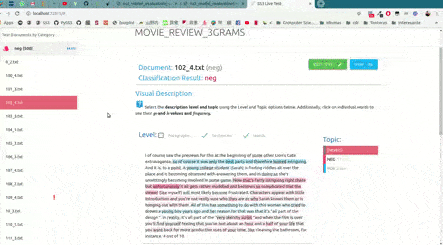

Welcome to PySS3's documentation!
=================================

The SS3 text classifier is a novel and simple supervised machine learning model for text
classification which is interpretable, that is, it has the **ability to naturally (self)explain its rationale**.
It was originally introduced in Section 3 of the paper
* `"A text classification framework for simple and effective early depression detection over social media streams" <https://dx.doi.org/10.1016/j.eswa.2019.05.023>`__ *
(`arXiv preprint <https://arxiv.org/abs/1905.08772>`__).
This simple model obtained the best and 2nd-best results, consecutively, in the last three editions of the
`CLEF's eRisk lab <https://erisk.irlab.org/>`__ among all participating models
[`Burdisso et al. 2019 <http://ceur-ws.org/Vol-2380/paper_103.pdf>`__;
`Loyola et al. 2021 <http://ceur-ws.org/Vol-2936/paper-81.pdf>`__].
Given its white-box nature, it allows researchers and practitioners to deploy interpretable (i.e. self-explainable)
and therefore more reliable, models for text classification (which could be especially useful for those working with
classification problems by which people's lives could be somehow affected).

`PySS3`_ is a Python package that allows you to work with :ref:`ss3-classifier` in a very
straightforward, interactive and visual way. In addition to the
implementation of the classifier, PySS3 comes with a set of tools
to help you developing your machine learning models in a clearer and
faster way. These tools let you analyze, monitor and understand your
models by allowing you to see what they have actually learned and why. To
achieve this, PySS3 provides you with 3 main components: the ``SS3``
class, the ``Live_Test`` class, and the ``Evaluation`` class, as pointed out below.

The ``SS3`` class
~~~~~~~~~~~~~~~~~

which implements the classifier using a clear API (very similar to that
of ``sklearn``):

.. code:: python

    from pyss3 import SS3
    clf = SS3()
    ...
    clf.fit(x_train, y_train)
    y_pred = clf.predict(x_test)

Also, this class provides a handful of other useful methods, such as, for instance, `classify_multilabel() <api/index.html#pyss3.SS3.classify_multilabel>`__ to provide `multi-label classification <https://en.wikipedia.org/wiki/Multi-label_classification>`__ support: 

.. code:: python

    doc = "Liverpool CEO Peter Moore on Building a Global Fanbase"
    
    # standard "single-label" classification
    label = clf.classify_label(doc) # 'business'

    # multi-label classification
    labels = clf.classify_multilabel(doc)  # ['business', 'sports']

or `extract_insight() <api/index.html#pyss3.SS3.extract_insight>`__ to allow you to :ref:`get the text fragments involved in the classification decision <extract-insight>`.

The ``Live_Test`` class
~~~~~~~~~~~~~~~~~~~~~~~

which allows you to interactively test your model and visually see the
reasons behind classification decisions, **with just one line of code**:

.. code:: python

    from pyss3.server import Live_Test
    from pyss3 import SS3

    clf = SS3()
    ...
    clf.fit(x_train, y_train)
    Live_Test.run(clf, x_test, y_test) # <- this one! cool uh? :)

As shown in the image below, this will open up, locally, an interactive
tool in your browser which you can use to (live) test your models with
the documents given in ``x_test`` (or typing in your own!). This will
allow you to visualize and understand what your model is actually
learning.

For example, we have uploaded two of these live tests online for you to
try out: `"Movie Review (Sentiment Analysis)" <http://tworld.io/ss3/live_test_online/#30305>`__ and
`"Topic
Categorization" <http://tworld.io/ss3/live_test_online/#30303>`__, both
were obtained following the :ref:`tutorials`.

And last but not least, the ``Evaluation`` class
~~~~~~~~~~~~~~~~~~~~~~~~~~~~~~~~~~~~~~~~~~~~~~~~

This is probably one of the most useful components of PySS3. As the name may suggest, this class provides the user easy-to-use methods for model evaluation and hyperparameter optimization, like, for example, the `test() <api/index.html#pyss3.util.Evaluation.test>`__, `kfold_cross_validation() <api/index.html#pyss3.util.Evaluation.kfold_cross_validation>`__, `grid_search() <api/index.html#pyss3.util.Evaluation.grid_search>`__, and `plot() <api/index.html#pyss3.util.Evaluation.plot>`__ methods for performing tests, stratified k-fold cross validations, grid searches for hyperparameter optimization, and visualizing evaluation results using an interactive 3D plot, respectively. Probably one of its most important features is the ability to automatically (and permanently) record the history of evaluations that you've performed. This will save you a lot of time and will allow you to interactively visualize and analyze your classifier performance in terms of its different hyper-parameters values (and select the best model according to your needs). For instance, let's perform a grid search with a 4-fold cross-validation on the three :ref:`hyperparameters <ss3-hyperparameter>`, smoothness(`s`), significance(`l`), and sanction(`p`):

.. code:: python

    from pyss3.util import Evaluation
    ...
    best_s, best_l, best_p, _ = Evaluation.grid_search(
        clf, x_train, y_train,
        s=[0.2, 0.32, 0.44, 0.56, 0.68, 0.8],
        l=[0.1, 0.48, 0.86, 1.24, 1.62, 2],
        p=[0.5, 0.8, 1.1, 1.4, 1.7, 2],
        k_fold=4
    )

In this illustrative example, `s`, `l`, and `p` will take those 6 different values each, and once the search is over, this function will return (by default) the hyperparameter values that obtained the best accuracy.
Now, we could also use the ``plot`` function to analyze the results obtained in our grid search using the interactive 3D evaluation plot:

.. code:: python

    Evaluation.plot()

In this 3D plot, each point represents an experiment/evaluation performed using that particular combination of values (s, l, and p). Also, these points are painted proportional to how good the performance was according to the selected metric; the plot will update "on the fly" when the user select a different evaluation metric (accuracy, precision, recall, f1, etc.). Additionally, when the cursor is moved over a data point, useful information is shown (including a "compact" representation of the confusion matrix obtained in that experiment). Finally, it is worth mentioning that, before showing the 3D plots, PySS3 creates a single and portable HTML file in your project folder containing the interactive plots. This allows users to store, send or upload the plots to another place using this single HTML file. For example, we have uploaded two of these files for you to see: `"Sentiment Analysis (Movie Reviews)" <_static/ss3_model_evaluation[movie_review_3grams].html>`__ and `"Topic Categorization" <_static/ss3_model_evaluation[topic_categorization_3grams].html>`__, both evaluation plots were obtained following the :ref:`tutorials`.

Want to give PySS3 a shot?
=========================

Just go to the :ref:`getting-started` page :D

----

Want to contribute to this Open Source project?
===============================================

Thanks for your interest in the project, you're awesome! Take a look at the `project Github repository <https://github.com/sergioburdisso/pyss3>`__, any kind of help is very welcome (Code, Bug reports, Content, Data, Documentation, Design, Examples, Ideas, Feedback, etc.),  Issues and/or Pull Requests are welcome for any level of improvement, from a small typo to new features, help us make PySS3 better.

Also, if you star the repo, you would be helping PySS3 to gain more visibility and reach the hands of people who may find it useful since repository lists and search results are usually ordered by the total number of stars.

.. raw:: html

  
  

  <a class="github-button" href="https://github.com/sergioburdisso/pyss3/subscription" data-icon="octicon-eye" data-size="large" data-show-count="true" aria-label="Watch sergioburdisso/pyss3 on GitHub">Watch</a>
  <a class="github-button" href="https://github.com/sergioburdisso/pyss3" data-icon="octicon-star" data-size="large" data-show-count="true" aria-label="Star sergioburdisso/pyss3 on GitHub">Star</a>
  <a class="github-button" href="https://github.com/sergioburdisso/pyss3/fork" data-icon="octicon-repo-forked" data-size="large" data-show-count="true" aria-label="Fork sergioburdisso/pyss3 on GitHub">Fork</a>
  

----

Further Readings
================

.. toctree::
   :maxdepth: 3
   :caption: User Guide

   user_guide/getting-started
   user_guide/installation
   user_guide/workflow
   user_guide/ss3-classifier
   user_guide/visualizations
..   user_guide/customization
..   user_guide/pyss3-command-line

.. toctree::
   :maxdepth: 1
   :caption: Tutorials

   tutorials/setup
   tutorials/topic-categorization
   tutorials/movie-review
   tutorials/extract-insight
   tutorials/custom-preprocessing
   tutorials/wordcloud

.. toctree::
   :maxdepth: 3
   :caption: API Documentation

   api/index

.. toctree::
   :maxdepth: 2
   :caption: About

   about/changelog
   about/contributing
   about/license

.. _PySS3: https://github.com/sergioburdisso/pyss3
.. _“Movie Review (Sentiment Analysis)”: http://tworld.io/ss3/live_test_online/#30305
.. _“Topic Categorization”: http://tworld.io/ss3/live_test_online/#30303
