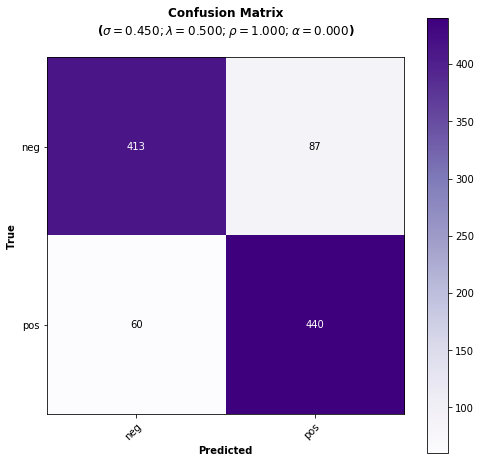
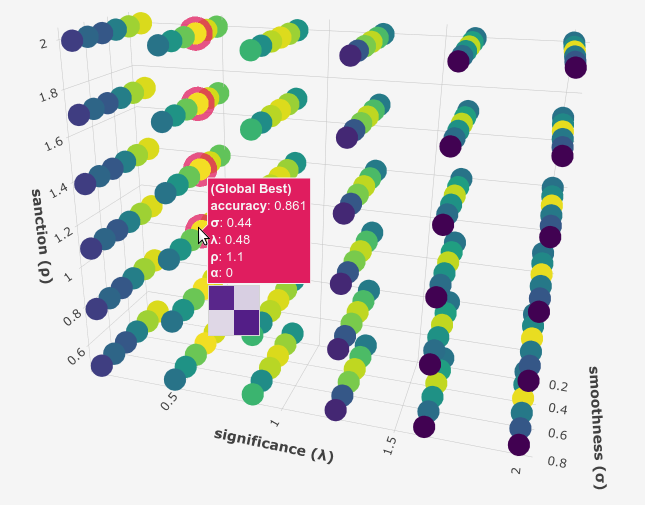
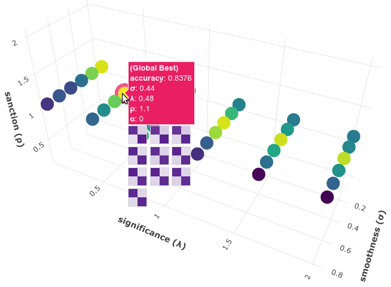

.. _movie-reviews-notebook:

**********************************************
Sentiment Analysis on Movie Reviews with PySS3
**********************************************

.. raw:: html

     
    
<i>To <b>open and run</b> this notebook <b style="color:#E66581">online</b>, click here: </i>

     
     

This is the notebook for the :ref:`"Sentiment
Analysis (on Movie Reviews)" <movie-reviews>`
tutorial. In this notebook, we will see how we can use the
`PySS3 <https://github.com/sergioburdisso/pyss3>`__ Python package to
deploy models for Sentiment Analysis on Movie Reviews.

Let us begin! First, we need to import the modules we will be using:

--------------

.. code:: python

    from pyss3 import SS3
    from pyss3.util import Dataset, Evaluation, span
    from pyss3.server import Live_Test
    
    from sklearn.metrics import accuracy_score

... and unzip the "movie\_review.zip" dataset inside the ``datasets`` folder.

.. code:: console

    !unzip -u datasets/movie_review.zip -d datasets/

Ok, now let's create a new instance of the SS3 classifier.

.. code:: python

    clf = SS3()

What are the default
:ref:`hyperparameter <ss3-hyperparameter>`
values? let's see

.. code:: python

    s, l, p, _ = clf.get_hyperparameters()
    
    print("Smoothness(s):", s)
    print("Significance(l):", l)
    print("Sanction(p):", p)

.. parsed-literal::

    Smoothness(s): 0.45
    Significance(l): 0.5
    Sanction(p): 1

Ok, now let's load the training and the test set document files using
the ``load_from_files`` function from ``pyss3.util`` as follow:

.. code:: python

    x_train, y_train = Dataset.load_from_files("datasets/movie_review/train")
    x_test, y_test = Dataset.load_from_files("datasets/movie_review/test")

.. parsed-literal::

    [2/2] Loading 'pos' documents: 100%|██████████| 5000/5000 [00:00<00:00, 5649.90it/s]
    [2/2] Loading 'pos' documents: 100%|██████████| 500/500 [00:00<00:00, 4703.76it/s]

Let's train our model...

.. code:: python

    clf.train(x_train, y_train)  # clf.fit(x_train, y_train)

.. parsed-literal::

    Training on 'pos': 100%|██████████| 2/2 [00:13<00:00,  6.61s/it]

Note that we don't have to create any document-term matrix! we are using
just the plain ``x_train`` documents :D cool uh? SS3 learns a (spacial
kind of) language model for each category and therefore it doesn't need
to create any document-term matrices :) in fact, the very concept of
"document" becomes irrelevant...

Now that the model has been trained, let's test it using the documents
in ``x_test``. First, we will do it "in the sklearn's own way" with:

.. code:: python

    y_pred = clf.predict(x_test)
    
    accuracy = accuracy_score(y_pred, y_test)
    
    print("Accuracy was:", accuracy)

.. parsed-literal::

    Classification: 100%|██████████| 1000/1000 [00:03<00:00, 271.75it/s]

    Accuracy was: 0.853

Alternatively, we could've done it "in the PySS3's own way" by using the
built-in ``test`` function provided by the ``Evaluation`` class that we
have imported from ``pyss3.util`` at the beginning of this notebook, as
follows:

.. code:: python

    Evaluation.test(clf, x_test, y_test)

.. parsed-literal::

    
                  precision    recall  f1-score   support
    
             neg       0.87      0.83      0.85       500
             pos       0.83      0.88      0.86       500
    
        accuracy                           0.85      1000
       macro avg       0.85      0.85      0.85      1000
    weighted avg       0.85      0.85      0.85      1000
    

The advantage of using this built-in function is that with just a single
line of code we get:

* The performance measured in terms of all the well-known metrics ('accuracy', 'precision', 'recall', and 'f1-score').

* A plot showing the obtained confusion matrix, and... 

* Since all the evaluations performed using the ``Evaluation`` class are permanently cached, if we ever perform this test again, the evaluation will be skipped and values will be retrieved from the cache storage (saving us a lot of time!  when performing long evaluations).

As we can see, the performance doesn't look bad using the default
:ref:`hyperparameter <ss3-hyperparameter>`
values, however, let's now manually analyze what our model has actually
learned by using the interactive "live test".

.. code:: python

    Live_Test.run(clf, x_test, y_test)

Makes sense to you? (remember you can use the options to select "words"
as the Description Level if you want to know based on what words, and to
what degree, is making classification decisions)

Live test doesn't look bad, however, we will create a "more intelligent"
model, a version of the model that can recognize variable-length word
n-grams "on the fly". Thus, when calling the ``train`` we will pass an
extra argument ``n_grams=3`` to indicate we want SS3 to learn to
recognize important words, bigrams, and 3-grams *(If you're curious and
want to know how this is actually done by SS3, read the paper "t-SS3: a
text classifier with dynamic n-grams for early risk detection over text
streams", preprint available* `here <https://arxiv.org/abs/1911.06147>`__ *)*.

.. code:: python

    clf = SS3(name="reviews-3grams")
    
    clf.train(x_train, y_train, n_grams=3)  # <-- note the n_grams=3 argument here

.. parsed-literal::

    Training on 'pos': 100%|██████████| 2/2 [00:19<00:00, 10.00s/it]

Now let's see if the performance has improved...

.. code:: python

    y_pred = clf.predict(x_test)
    print("Accuracy:", accuracy_score(y_pred, y_test))

.. parsed-literal::

    Classification: 100%|██████████| 1000/1000 [00:04<00:00, 243.31it/s]

    Accuracy: 0.856

Yeah, the accuracy slightly improved but more importantly, we should now
see that the model has learned "more intelligent patterns" involving
sequences of words when using the interactive "live test" (like "was
supposed to", "has nothing to", "low budget", "your money", etc. for the
"negative" class). Let's see...

.. code:: python

    Live_Test.run(clf, x_test, y_test)

If we want to improve performance even more, we could try using
different hyperparameter values, for example, the following
:ref:`hyperparameter <ss3-hyperparameter>`
values will slightly improve our classification performance:

.. code:: python

    clf.set_hyperparameters(s=.44, l=.48, p=0.5)

Let's see if it's true...

.. code:: python

    y_pred = clf.predict(x_test)
    print("Accuracy:", accuracy_score(y_pred, y_test))

.. parsed-literal::

    Classification: 100%|██████████| 1000/1000 [00:05<00:00, 179.46it/s]

    Accuracy: 0.861

Great! the accuracy has improved, indeed! :D

Finally, we could take a look at what our final model looks like using
the Live Test tool one last time.

.. code:: python

    Live_Test.run(clf, x_test, y_test)

**Want to know how we found out those hyperparameter values** were going to improve our classifier
accuracy? Just read the next section!
;)

--------------

Hyperparameter Optimization
---------------------------

In this section we will see how we can use PySS3's ``Evaluation`` class
to perform `Hyperparameter
optimization <https://en.wikipedia.org/wiki/Hyperparameter_optimization>`__,
which allows us to find better hyperparameter values for our models. To
do this, we will perform `grid
searches <https://en.wikipedia.org/wiki/Hyperparameter_optimization#Grid_search>`__
using the
`Evaluation.grid\_search() <../api/index.html#pyss3.util.Evaluation.grid_search>`__
function.

Let's create a new (standard) instance of the SS3 classifier. This will speed things up because the model we currently have in ``clf`` recognize variable-length word n-grams, the grid search won't run as fast as with a (standard) model that recognize only words (and the same "best" hyperparameter values usually work for both of them).

.. note::

    Just ignore the (optional) ``name`` argument below, we're giving our model the name "movie-reviews" only to make things clearer when we create the interactive 3D evaluation plot.

.. code:: python

    clf = SS3(name="movie-reviews")

    clf.train(x_train, y_train)

The
`Evaluation.grid\_search() <../api/index.html#pyss3.util.Evaluation.grid_search>`__
takes, for each hyperparameter, the list of values to use in the search,
for instance ``s=[0.25, 0.5, 0.75, 1]`` indicates you want the
``grid_search`` to try out evaluating the classifier using those 4
values for the sigma (``s``) hyperparameter. However, for simplicity,
instead of using a manually crafted long list of values, we will use the
``span`` function we have imported from ``pyss3.util`` at the beginning
of this notebook. This function will create a list of values for us,
giving a lower and upper bound, and the number of elements to be
generated. For instance, if we want a list of 6 numbers between 0 and 1,
we could use:

.. code:: python

    span(0, 1, 6)

.. parsed-literal::

    [0. , 0.2, 0.4, 0.6, 0.8, 1. ]

Thus, we will use the following values for each of the three
hyperparameters:

.. code:: python

    s_vals=span(0.2, 0.8, 6)  # [0.2 , 0.32, 0.44, 0.56, 0.68, 0.8]
    l_vals=span(0.1, 2, 6)    # [0.1 , 0.48, 0.86, 1.24, 1.62, 2]
    p_vals=span(0.5, 2, 6)    # [0.5, 0.8, 1.1, 1.4, 1.7, 2]

First, we will perform a grid search using the test set. Once the search
is over, ``Evaluation.grid_search`` will return the hyperparamter values
that obtained the best accuracy.

.. note::

    Just ignore the ``tag`` argument below, do not worry about it,
    it is optional. We are using it here just to give this search a name
    (``"grid search (test)"``) because it will make identification of each
    individual search clearer and easier for us in the last section
    ("Interactive 3D Evaluation Plot") when we need it.

.. code:: python

    # the search should take 2-3 minutes
    best_s, best_l, best_p, _ = Evaluation.grid_search(
        clf, x_test, y_test,
        s=s_vals, l=l_vals, p=p_vals,
        tag="grid search (test)"  # <-- this is optional! >_<
    )

.. parsed-literal::

    Grid search: 100%|██████████| 216/216 [02:43<00:00,  4.75s/it]

.. code:: python

    print("The hyperparameter values that obtained the best Accuracy are:")
    print("Smoothness(s):", best_s)
    print("Significance(l):", best_l)
    print("Sanction(p):", best_p)

.. parsed-literal::

    The hyperparameter values that obtained the best Accuracy are:
    Smoothness(s): 0.44
    Significance(l): 0.48
    Sanction(p): 0.5

And that's how we found out that these hyperparameter values
(``s=0.44, l=0.48, p=0.5``) were going to improve our classifier
accuracy.

Finally, there is an optional (but recommended) step. To make sure the
selected hyperparameters generalize well (i.e. are not overfitted to the
test set), it is good practice to perform the grid search using k-fold
cross-validation on the training set. Thus, we'll use the ``k_fold``
argument of ``Evaluation.grid_search()`` to indicate we want to use
(stratified) 10-fold cross-validation (``k_fold=10``), as follows:

.. code:: python

    # the search should take 5-8 minutes
    best_s, best_l, best_p, _ = Evaluation.grid_search(
        clf, x_train, y_train,
        k_fold=10,
        s=s_vals, l=l_vals, p=0.5,
        tag="grid search (10-fold)"  # <-- remember this is optional! >_<
    )

.. parsed-literal::

    [fold 10/10] Grid search: 100%|██████████| 36/36 [00:36<00:00,  4.78s/it]

.. code:: python

    print("The hyperparameter values that obtained the best accuracy are:")
    print("Smoothness(s):", best_s)
    print("Significance(l):", best_l)
    print("Sanction(p):", best_p)

.. parsed-literal::

    The hyperparameter values that obtained the best accuracy are:
    Smoothness(s): 0.44
    Significance(l): 0.48
    Sanction(p): 0.5

The same hyperparameter values performed the best on the training data
using 10-fold cross-validation. This means we can use the selected
hyperparameter values (``s=0.44, l=0.48 and p=0.5``) safely.

Note that this time we used a fixed value for ``p``, namely, ``p = 0.5``
to perform the grid search. We decided to use this single value to speed
up the search since, as we will see in the next subsection, this
"sanction"(``p``) hyperparameter doesn't seem to have a real impact on
performance in this task.

.. note::

    What if we want to find hyperparameter values that performed
    the best but using a different metric other than accuracy? for example,
    what if we wanted to find the hyperparameter values that will improve
    the precision for the (neg)ative class? we can use the
    ``Evaluation.get_best_hyperparameters()`` function as follows:

    .. code:: python

        s, l, p, _ = Evaluation.get_best_hyperparameters(metric="precision", metric_target="neg")

        print("s=%.2f, l=%.2f, and p=%.2f" % (s, l, p))

    .. parsed-literal::

        s=0.56, l=2.0, and p=0.5

    Or the macro averaged f1 score?

    .. code:: python

        s, l, p, _ = Evaluation.get_best_hyperparameters(metric="f1-score", metric_target="macro avg")

        print("s=%.2f, l=%.2f, and p=%.2f" % (s, l, p))

    .. parsed-literal::

        s=0.44, l=0.48, and p=0.5

    Alternatively, we could have also added these 2 arguments, metric and
    target, to the grid search in the first place :) (e.g. ``Evaluation.grid_search(..., metric="f1-score", metric_target="macro avg")``).

    Note that this ``get_best_hyperparameters`` function gave us the values
    right away! this is because instead of performing the grid search again,
    this function uses the evaluation cache to retrieve the best values from
    disk, which save us a lot of time!

Interactive 3D Evaluation Plot
~~~~~~~~~~~~~~~~~~~~~~~~~~~~~~

The ``Evaluation`` class comes with a really useful function,
``Evaluation.plot()``, that we can use to create an interactive 3D
evaluation plot (We highly recommend reading this `brief
section <../user_guide/visualizations.html#evaluation-plot>`__,
from the documentation, in which it is briefly described). Instead of
using the single value returned from the ``Evaluation.grid_search()`` we
could use this plot to have a broader view of the relationship between
the different hyperparameter values and the performance of our model in
the task being addressed. The ``Evaluation.plot()`` function creates a
portable HTML file containing the interactive plot for us, and then
opens it up in your browser. Let's give it a shot:

.. code:: python

    Evaluation.plot()

You should see a plot like this one:

You probably noted that there are multiple points with the global best
performance, this is probably due to the problem being addressed
(sentiment analysis) being a binary classification problem (thus, the
"sanction" hyperparameter doesn't have much impact with only two
categories). We could choose any of the best values, for instance,
``grid_search`` gave us the one with the lowest "sanction" (p) value
(Rotate the plot and move the cursor over this point and see the
information that is displayed).

In the option panel (left side), note that in the "Tag" entry says "grid
search (test)", that means we are seeing evaluation results regarding
the first grid search, the one we performed using the test set. To see
the plot for the second grid search, in which we use 10-fold
cross-validation, we can simply select its tag from the list:

.. figure:: ../_static/movie_review_evaluations_kfold_op_python.png
   :alt: 

In the plot for this second grid search not only can we see that the
same point (``s=0.44, l=0.48, p=0.5``) has the best performance, but
more importantly, if we move the cursor over this point, we can also see
that all the 10 confusion matrices looks really well and consistent,
that means that this hyperparameter configuration performed consistently
well across all 10 folds!

Therefore, we're quite sure we can safely use the selected
hyperparameter values :D

(Feel free to play a little bit with this interactive 3D evaluation plot, for instance try changing the metric and target from the options panel)
