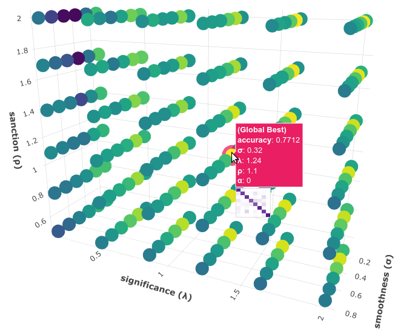

.. _topic-categorization:

********************
Topic Categorization
********************

In this tutorial we will develop an :ref:`SS3 classifier <ss3-classifier>` for topic categorization. We will work with a special dataset that we have created for this tutorial to train our model. This dataset was created collecting tweets with hashtags related to these 8 different categories: *"art&photography", "beauty&fashion", "business&finance", "food", "health", "music", "science&technology" and "sports"*. The dataset contains around 29k tweets for training on each category and only 100 tweets for testing on each one. Additionally, instead of having a folder for each category, training and test folder have a single .txt file for each category containing a tweet on each line.
Finally, there's an extra folder, called "live_test", with 9 test documents that we will use to visually check that our model has learned properly. So, basically the dataset is structured like this:

.. code:: console

 datasets/topic
    ├── live_test
    │   └── test docs
    │       ├── doc_1.txt
    │       ├── doc_2.txt
    │       ├── doc_3.txt
    │       ├── doc_4.txt
    │       ├── doc_5.txt
    │       ├── doc_6.txt
    │       ├── doc_7.txt
    │       ├── doc_8.txt
    │       └── doc_9.txt
    ├── test
    │   ├── art&photography.txt
    │   ├── beauty&fashion.txt
    │   ├── business&finance.txt
    │   ├── food.txt
    │   ├── health.txt
    │   ├── music.txt
    │   ├── science&technology.txt
    │   └── sports.txt
    └── train
        ├── art&photography.txt
        ├── beauty&fashion.txt
        ├── business&finance.txt
        ├── food.txt
        ├── health.txt
        ├── music.txt
        ├── science&technology.txt
        └── sports.txt

Before we begin, go to :ref:`tutorial-setup` and make sure you have everything we need.

As it is described in :ref:`workflow`, you can choose between two possible paths to carry out this tutorial: :ref:`topic_classic-workflow` (using python) or :ref:`topic_command-line-workflow` (using only the ``PySS3 Command-Line`` tool)

.. _topic_classic-workflow:

Classic Workflow
================

Click :ref:`here <topic_categorization-notebook>` to go to the :ref:`tutorial notebook <topic_categorization-notebook>`.

.. note:: Want to run this Jupyter Notebook on your computer?

  1. Go to :ref:`tutorial-setup` and make sure you have everything we need.

  2. Make sure you're in the PySS3's "examples" folder...

  .. code:: console

      cd your/path/to/pyss3/examples

  and that our conda environment is activated:

  .. code:: console

      conda activate pyss3tutos

  3. Then, lunch Jupyter Notebook and and run the "movie_review.ipynb" notebook (make sure to select the "pyss3tutos" kernel).

  .. code:: console

      jupyter notebook

.. _topic_command-line-workflow:

Command-Line Workflow
=====================

.. note:: Before beginning, make sure you have everything ready by reading the :ref:`tutorial-setup` section.

Make sure you're in the PySS3's "examples" folder and that our conda environment is activated:

.. code:: console

    your@user:~$ cd /your/path/to/pyss3/examples
    your@user:/your/path/to/pyss3/examples$ conda activate pyss3tutos

Make sure the dataset is unzipped, for instance by using ``unzip``:

.. code:: console

    your@user:/your/path/to/pyss3/examples$ unzip -u datasets/topic.zip -d datasets/

Now use the "pyss3" command to run the ``PySS3 Command Line`` tool:

.. code:: console

    your@user:/your/path/to/pyss3/examples$ pyss3

We will create a new model using the ``new`` command, we will call this model "topic_categorization":

.. code:: console

    (pyss3) >>> new topic_categorization

What are the default :ref:`hyperparameter <ss3-hyperparameter>` values? let's see

.. code:: console

    (pyss3) >>> info

which displays the following:

.. code:: console

 NAME: topic_categorization

 HYPERPARAMETERS:

    Smoothness(s): 0.45
    Significance(l): 0.5
    Sanction(p): 1

    Alpha(a): 0.0

 CATEGORIES: None

That is, ``s=0.45``, ``l=0.5``, and ``p=1``. Note that "CATEGORIES" is None which is OK since we haven't trained our model yet.

To train train our model we will use the ``train`` command, let's use the ``help`` command to see more details about this command:

.. code:: console

    (pyss3) >>> help train

which displays the following help:

.. code:: console

        Train the model using a training set and then save it.

        usage:
            train TRAIN_PATH [LABEL] [N-gram]

        required arguments:
         TRAIN_PATH     the training set path

        optional arguments:
         LABEL          where to read category labels from.
                        values:{file,folder} (default: folder)

         N-grams        indicates the maximum n-grams to be learned (e.g. a
                        value of "1-grams" means only words will be learned;
                        "2-grams" only 1-grams and 2-grams;
                        "3-grams", only 1-grams, 2-grams and 3-grams;
                        and so on).
                        value: {N-grams} with N integer > 0 (default: 1-grams)

        examples:
         train a/training/set/path 3-grams

``train`` expects at least the path to the training set, and optionally, two extra arguments, LABEL and N-grams (we will ignore N-grams for now). LABEL takes two values, "file" or "folder". Since there’s a single file for each category in our training set, we will use the argument "file" to tell PySS3 that each file is a different category and each line inside of it as a different document:

.. code:: console

    (pyss3) >>> train datasets/topic/train file

Now that the model has been trained, let's see how good our model performs. To do this, since the test set has the same structure as the training set, we will use the ``test`` command also with the "file" extra argument:

.. code:: console

    (pyss3) >>> test datasets/topic/test file

which, among other things it displays:

.. code:: console

 accuracy: 0.704

Not bad using the default :ref:`hyperparameter <ss3-hyperparameter>` values, let's now manually analyze what our model has actually learned by using the interactive "live test".

.. code:: console

    (pyss3) >>> live_test datasets/topic/live_test

.. note:: here we are not using the "file" argument because inside the "live_test" folder each file is a different document (not a different category).

Live test doesn't look bad, however, we will create a "more intelligent" version of this model, a version that can recognize variable-length word n-grams "on the fly". So, let's begin by creating a new model called "topic_categorization_3grams":

.. code:: console

    (pyss3) >>> new topic_categorization_3grams

As we said above, we want this model to learn to recognize variable-length n-grams. Fortunately, as it was displayed with ``help train``, we know that the ``train`` command accepts an extra argument: *N*-grams (where *N* is any positive integer). This argument will allow us to do what we want, we will use ``3-grams`` to indicate we want SS3 to learn to recognize important words, bigrams, and 3-grams **(*)**

.. code:: console

    (pyss3) >>> train datasets/topic/train file 3-grams

**(*)** *If you're curious and want to know how this is actually done by SS3, read the paper "t-SS3: a ext classifier with dynamic n-grams for early risk detection over text streams"* (preprint available `here <https://arxiv.org/abs/1911.06147>`__).

Now let's see if the performance has improved...

.. code:: console

    (pyss3) >>> test datasets/topic/test file

which now displays:

.. code:: console

 accuracy: 0.719

Yeah, the accuracy slightly improved but more importantly, we should now see that the model has learned “more intelligent patterns” involving sequences of words when using the interactive “live test” to observe what our model has learned (like “machine learning”, “artificial intelligence”, “self-driving cars”, etc. for the “science&technology” category. Let’s see…

.. code:: console

    (pyss3) >>> live_test datasets/topic/live_test

Fortunately, our model has learned to recognize these important sequences (such as “artificial intelligence” and “machine learning” in doc_2.txt, “self-driving cars” in doc_6.txt, etc.). However, some documents aren't perfectly classified, for instance, *doc_3.txt* was classified as "science&technology" (as a third topic) which is clearly wrong...

We will use better :ref:`hyperparameter <ss3-hyperparameter>` values to improve our classifier performance. Namely, we will set ``s=0.32``, ``l=1.24`` and ``p=1.1`` which will improve the accuracy of our model:

.. code:: console

    (pyss3) >>> set s 0.32 l 1.24 p 1.1

.. note:: if you want to know how we found out that these values were going to improve our model's accuracy, it is explained in the next subsection (:ref:`topic_hyperparameter-optimization-command-line`), so we really recommend reading it after completing this section.

Let's see if the accuracy really improves using this values:

.. code:: console

    (pyss3) >>> test datasets/topic/test file

which displays:

.. code:: console

 accuracy: 0.771

Great! the accuracy improved :)

We will save this model in case we want to load it later...

.. code:: console

    (pyss3) >>> save

Optionally, you can again use the "live test" to manually check the final version of our model...

.. code:: console

    (pyss3) >>> live_test datasets/topic/live_test

Perfect! now the documents are classified properly! (including *doc_3.txt*) :D

And that's it! use the following command to exit the ``PySS3 Command Line`` (or just press Ctrl+D):

.. code:: console

    (pyss3) >>> exit

Congratulations! you have created an SS3 model for topic categorization without a single line of code, buddy :)

.. _topic_hyperparameter-optimization-command-line:

Hyperparameter Optimization
----------------------------

As mentioned earlier, hyperparameter optimization will allow us to find better :ref:`hyperparameter <ss3-hyperparameter>` values for our model.  To begin with, we will perform a grid search over the test set. To carry out this task, we will use the ``grid_search`` command. Let's see what this command does and how to use it, using the ``help`` command:

.. code:: console

    (pyss3) >>> help grid_search

which displays the following help:

.. code:: console

    Given a dataset, perform a grid search using the given hyperparameters values.

    usage:
        grid_search PATH [LABEL] [DEF_CAT] [METHOD] P EXP [P EXP ...] [no-cache]

    required arguments:
     PATH       the dataset path
     P EXP      a list of values for a given hyperparameter.
                where:
                 P    is a hyperparameter name. values: {s,l,p,a}
                 EXP  is a python expression returning a float or
                      a list of floats. Note: if this expression
                      contains whitespaces, use quotations marks
                      (e.g. "[0.5, 1.5]")
                examples:
                 s [.3,.4,.5]
                 s "[.3, .4, .5]" (Note the whitespaces and the "")
                 p r(.2,.8,6)     (i.e. 6 points between .2 to .8)

    optional arguments:
     LABEL      where to read category labels from.
                values:{file,folder} (default: folder)

     DEF_CAT    default category to be assigned when the model is not
                able to actually classify a document.
                values: {most-probable,unknown} or a category label
                (default: most-probable)

     METHOD     the method to be used
                values: {test, K-fold} (default: test)
                where:
                  K-fold  indicates the number of folds to be used.
                          K is an integer > 1 (e.g 4-fold, 10-fold, etc.)

     no-cache   if present, disable the cache and recompute all the values

    examples:
     grid_search a/testset/path s r(.2,.8,6) l r(.1,2,6) -p r(.5,2,6) a [0,.01]
     grid_search a/dataset/path 4-fold -s [.2,.3,.4,.5] -l [.5,1,1.5] -p r(.5,2,6)

From this help, we can see that this command expects at least a path and a list of :ref:`hyperparameter <ss3-hyperparameter>` names and, after each :ref:`hyperparameter <ss3-hyperparameter>` name, any python expression that returns either a number or a list of numbers, for instance, ``-s [.2,.35,.4,.55]``. In our case, we will use the built-in function ``r(x0,x1,n)`` which returns a list of ``n`` numbers between ``x0`` and ``x1`` (including both), as follows:

.. code:: console

    (pyss3) >>> grid_search datasets/topic/test file -s r(.2,.8,6) -l r(.1,2,6) -p r(.5,2,6)

*Note that here,* ``s`` *will take 6 different values between .2 and .8,* ``l`` *between .1 and 2, and* ``p`` *between .5 and 2.*

Now it is time to wait (for about 20 minutes) until the grid search is completed.

Once the grid search is over, we will use the following command to open up an interactive 3D plot in the browser that we can use to analyze the obtained results:

.. code:: console

    (pyss3) >>> plot evaluations

PySS3 should have created `this plot <../_static/ss3_model_evaluation[topic_categorization_3grams].html>`__ on your machine. **Note:** We recommend reading the :ref:`evaluation-plot` page in which the plots and the user interface are explained in detail.

Rotate the plot and move the cursor over the point with the best performance (pink border) and see the information that is displayed, as shown in the following figure:

Here we can see that using these :ref:`hyperparameter <ss3-hyperparameter>` values, our classifier will obtain a better accuracy (0.7712):

* smoothness (:math:`\sigma`): 0.32
* significance (:math:`\lambda`): 1.24
* sanction (:math:`\rho`): 1.1

That is, we need to set ``s=0.32``, ``l=1.24`` and ``p=1.1``. To do this we could use the ``set`` and ``save`` commands to update and save our model for later use:

.. code:: console

    (pyss3) >>> set s 0.32 l 1.24 p 1.1
    (pyss3) >>> save

.. note::
    if you want to use these hyperparameter values with python, there are at least three ways we can configure our SS3 classifier:

    * Creating a new classifier using these hyperparameter values:

    .. code:: python

        clf = SS3(s=0.32, l=1.24, p=1.1)

    * Changing the hyperparameter values of an already existing model using the ``set_hyperparameters`` method:

    .. code:: python

        clf = SS3()
        ...
        clf.set_hyperparameters(s=0.32, l=1.24, p=1.1)

    * Or, using the ``PySS3 Command Line``:

        1. Use the ``set`` and ``save`` commands to update and save the model

        .. code:: console

            (pyss3) >>> set s 0.32 l 1.24 p 1.1
            (pyss3) >>> save

        2. And then, use the ``load_model`` method to load the model with python:

        .. code:: python

            clf = SS3(name="movie_review_3grams")
            ...
            clf.load_model()
