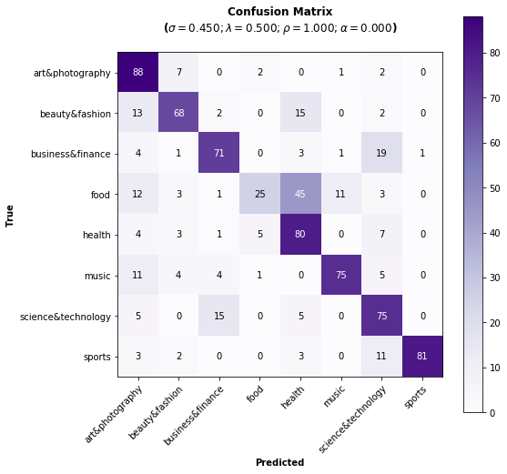
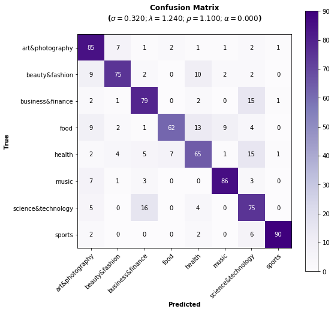

.. _topic_categorization-notebook:

*******************************
Topic Categorization with PySS3
*******************************

.. raw:: html

     
    
<i>To <b>open and run</b> this notebook <b style="color:#E66581">online</b>, click here: </i>

     
     

This is the notebook for the `"Topic
Categorization" <topic-categorization.html>`__
tutorial. In this notebook, we will see how we can use the
`PySS3 <https://github.com/sergioburdisso/pyss3>`__ Python package to
deploy models for Sentiment Analysis on Movie Reviews.

Let us begin! First, we need to import the modules we will be using:

--------------

Before we begin, let's import needed modules...

.. code:: python

    from pyss3 import SS3
    from pyss3.util import Dataset, Evaluation, span
    from pyss3.server import Live_Test
    
    from sklearn.metrics import accuracy_score

... and unzip the "movie\_review.zip" dataset inside the ``datasets``
folder.

.. code:: shell

    !unzip -u datasets/topic.zip -d datasets/

Ok, now we are ready to begin. Let's create a new SS3 instance

.. code:: python

    clf = SS3()

What are the default
`hyperparameter <../user_guide/ss3-classifier.html#hyperparameters>`__
values? let's see

.. code:: python

    s, l, p, _ = clf.get_hyperparameters()
    
    print("Smoothness(s):", s)
    print("Significance(l):", l)
    print("Sanction(p):", p)

.. parsed-literal::

    Smoothness(s): 0.45
    Significance(l): 0.5
    Sanction(p): 1

Ok, now let's load the training and the test set using the
``load_from_files`` function from ``pyss3.util``. Since, in this
dataset, there's a single file for each category, we will use the
argument ``folder_label=False`` to tell PySS3 to use each file as a
different category and each line inside of it as a different document:

.. code:: python

    x_train, y_train = Dataset.load_from_files("datasets/topic/train", folder_label=False)
    x_test, y_test = Dataset.load_from_files("datasets/topic/test", folder_label=False)

.. parsed-literal::

    Loading 'sports' documents: 100%|██████████| 8/8 [00:00<00:00, 82.58it/s]            
    Loading 'sports' documents: 100%|██████████| 8/8 [00:00<00:00, 1220.96it/s]            

Let's train our model...

.. code:: python

    clf.train(x_train, y_train)  # clf.fit(x_train, y_train)

.. parsed-literal::

    Training on 'sports': 100%|██████████| 8/8 [00:29<00:00,  3.65s/it]            

Note that we don't have to create any document-term matrix! we are using
just the plain ``x_train`` documents :D cool uh? SS3 learns a (spacial
kind of) language model for each category and therefore it doesn't need
to create any document-term matrices :) in fact, the very concept of
"document" becomes irrelevant...

Now that the model has been trained, let's test it using the documents
in ``x_test``. First, we will do it "in the sklearn's own way" with:

.. code:: python

    y_pred = clf.predict(x_test)
    
    accuracy = accuracy_score(y_pred, y_test)
    
    print("Accuracy was:", accuracy)

.. parsed-literal::

    Classification: 100%|██████████| 800/800 [00:00<00:00, 842.02it/s]

    Accuracy was: 0.70375

Alternatively, we could've done it "in the PySS3's own way" by using the
built-in ``test`` function provided by the ``Evaluation`` class that we
have imported from ``pyss3.util`` at the beginning of this notebook, as
follows:

.. code:: python

    Evaluation.test(clf, x_test, y_test)

.. parsed-literal::

    
                        precision    recall  f1-score   support
    
       art&photography       0.63      0.88      0.73       100
        beauty&fashion       0.77      0.68      0.72       100
      business&finance       0.76      0.71      0.73       100
                  food       0.76      0.25      0.38       100
                health       0.53      0.80      0.64       100
                 music       0.85      0.75      0.80       100
    science&technology       0.60      0.75      0.67       100
                sports       0.99      0.81      0.89       100
    
              accuracy                           0.70       800
             macro avg       0.74      0.70      0.69       800
          weighted avg       0.74      0.70      0.69       800

The advantage of using this built-in function is that with just a single
line of code we get:

* The performance measured in terms of all the well-known metrics ('accuracy', 'precision', 'recall', and 'f1-score').
* A plot showing the obtained confusion matrix, and... 
* Since all the evaluations performed using the ``Evaluation`` class are permanently cached, if we ever perform this test again, the evaluation will be skipped and values will be retrieved from the cache storage (saving us a lot of time! especially when performing long evaluations).

As we can see, the performance doesn't look bad using the default
`hyperparameter <../user_guide/ss3-classifier.html#hyperparameters>`__
values, however, let's now manually analyze what our model has actually
learned by using the interactive "live test". Note that since we are not
going to use the ``x_test`` for this live test\ **(\*)** but instead the
documents in "datasets/topic/live\_test", we must use the
``set_testset_from_files`` method to tell the Live Test to load
documents from there instead.

**(\*)** *try it if you want but since ``x_test`` contains
(preprocessed) tweets, they don't look really good and clean.*

.. code:: python

    # Live_Test.run(clf, x_test, y_test)  # <- this visualization doesn't look really clean and good so, instead,
                                          #    we will use the documents in "live_test" folder:
    
    Live_Test.set_testset_from_files("datasets/topic/live_test")
    
    Live_Test.run(clf)

.. parsed-literal::

     Classifying 'test docs' docs: 100%|██████████| 10/10 [00:00<00:00, 125.39it/s]

Makes sense to you? (remember you can use the options to select "words"
as the Description Level if you want to know based on what words, and to
what degree, is making classification decisions)

Live test doesn't look bad, however, we will create a "more intelligent"
version of this model, a version that can recognize variable-length word
n-grams "on the fly". Thus, when calling the ``train`` we will pass an
extra argument ``n_grams=3`` to indicate we want SS3 to learn to
recognize important words, bigrams, and 3-grams *(If you're curious and
want to know how this is actually done by SS3, read the paper "t-SS3: a
text classifier with dynamic n-grams for early risk detection over text
streams", preprint available* 
`here <https://arxiv.org/abs/1911.06147>`__ *)*.

.. code:: python

    # ignore this (optional) ``name`` argument here, we're giving our
    # model the name "topics-3grams" only to make things clearer
    # for the (optional) last section
    clf = SS3(name="topics_3grams")
    
    clf.train(x_train, y_train, n_grams=3)  # <-- note the n_grams=3 argument here

.. parsed-literal::

    Training on 'sports': 100%|██████████| 8/8 [00:36<00:00,  4.51s/it]            

Now let's see if the performance has improved...

.. code:: python

    y_pred = clf.predict(x_test)
    print("Accuracy:", accuracy_score(y_pred, y_test))

.. parsed-literal::

    Classification: 100%|██████████| 800/800 [00:01<00:00, 665.29it/s]

    Accuracy: 0.71875

Yeah, the accuracy slightly improved but more importantly, we should now
see that the model has learned "more intelligent patterns" involving
sequences of words when using the interactive "live test" (like "machine
learning", "artificial intelligence", "self-driving cars", etc. for the
"science&technology" category). Let's see...

.. code:: python

    Live_Test.run(clf)

Fortunately, our model has learned to recognize these important
sequences (such as "artificial intelligence" and "machine learning" in
doc\_2.txt, "self-driving cars" in doc\_6.txt, etc.). However, some
documents aren’t perfectly classified, for instance, doc\_10.txt was
classified as “science&technology” (as the second topic) which is
clearly wrong...

So, one last thing we are going to do is to try to find better
`hyperparameter <../user_guide/ss3-classifier.html#hyperparameters>`__
values to improve our model's performance. For example, the following
values will improve our classification performance:

.. code:: python

    clf.set_hyperparameters(s=0.32, l=1.62, p=2.55)

Let's see if it's true...

.. code:: python

    Evaluation.test(clf, x_test, y_test)

.. parsed-literal::

    
                        precision    recall  f1-score   support
    
       art&photography       0.70      0.85      0.77       100
        beauty&fashion       0.83      0.75      0.79       100
      business&finance       0.74      0.79      0.76       100
                  food       0.87      0.62      0.73       100
                health       0.67      0.65      0.66       100
                 music       0.87      0.86      0.86       100
    science&technology       0.61      0.75      0.68       100
                sports       0.97      0.90      0.93       100
    
              accuracy                           0.77       800
             macro avg       0.78      0.77      0.77       800
          weighted avg       0.78      0.77      0.77       800

The accuracy has improved as expected and the confusion matrix look much
better now :)

Finally, we could take a look at what our final model looks like using
the Live Test tool one last time.

.. code:: python

    Live_Test.run(clf)

**Want to know how we found out those hyperparameter values** were going
to improve our classifier accuracy? Just read the next section! ;)

--------------

Hyperparameter Optimization
---------------------------

In this section we will see how we can use PySS3's ``Evaluation`` class
to perform `Hyperparameter
optimization <https://en.wikipedia.org/wiki/Hyperparameter_optimization>`__,
which allows us to find better hyperparameter values for our models. To
do this, we will perform `grid
searches <https://en.wikipedia.org/wiki/Hyperparameter_optimization#Grid_search>`__
using the
`Evaluation.grid\_search() <../api/index.html#pyss3.util.Evaluation.grid_search>`__
function.

Let's create a new (standard) instance of the SS3 classifier. This will speed things up because the model we currently have in ``clf`` recognize variable-length word n-grams, the grid search won't run as fast as with a (standard) model that recognize only words (and the same "best" hyperparameter values usually work for both of them).

.. note::

    Just ignore the (optional) ``name`` argument below, we're giving our model the name "topics" only to make things clearer when we create the interactive 3D evaluation plot.

.. code:: python

    clf = SS3(name="topics")

    clf.train(x_train, y_train)

The
`Evaluation.grid\_search() <../api/index.html#pyss3.util.Evaluation.grid_search>`__
takes, for each hyperparameter, the list of values to use in the search,
for instance ``s=[0.25, 0.5, 0.75, 1]`` indicates you want the
``grid_search`` to try out evaluating the classifier using those 4
values for the sigma (``s``) hyperparameter. However, for simplicity,
instead of using a manually crafted long list of values, we will use the
``span`` function we have imported from ``pyss3.util`` at the beginning
of this notebook. This function will create a list of values for us,
giving a lower and upper bound, and the number of elements to be
generated. For instance, if we want a list of 6 numbers between 0 and 1,
we could use:

.. code:: python

    span(0, 1, 6)

.. parsed-literal::

    [0. , 0.2, 0.4, 0.6, 0.8, 1. ]

Thus, we will use the following values for each of the three
hyperparameters:

.. code:: python

    s_vals=span(0.2, 0.8, 6)  # [0.2 , 0.32, 0.44, 0.56, 0.68, 0.8]
    l_vals=span(0.1, 2, 6)    # [0.1 , 0.48, 0.86, 1.24, 1.62, 2]
    p_vals=span(1.75, 2.75, 6)    # [1.75, 1.95, 2.15, 2.35, 2.55, 2.75]

To speed things up, unlike in the :ref:`"Movie Reviews (Sentiment
Analysis)" <movie-reviews>`
tutorial, we will perform the grid search using only the test set (we
won't use k-fold cross-validation). Once the search is over,
``Evaluation.grid_search`` will return the hyperparamter values that
obtained the best accuracy for us.

.. code:: python

    # the search should take about 15 minutes
    best_s, best_l, best_p, _ = Evaluation.grid_search(
        clf, x_test, y_test,
        s=s_vals, l=l_vals, p=p_vals
    )

.. parsed-literal::

    Grid search: 100%|██████████| 216/216 [15:04<00:00,  6.00s/it]

.. code:: python

    print("The hyperparameter values that obtained the best Accuracy are:")
    print("Smoothness(s):", best_s)
    print("Significance(l):", best_l)
    print("Sanction(p):", best_p)

.. parsed-literal::

    The hyperparameter values that obtained the best Accuracy are:
    Smoothness(s): 0.32
    Significance(l): 1.62
    Sanction(p): 2.55

And that's how we found out that these hyperparameter values
(``s=0.32, l=1.62, p=2.55``) were going to improve our classifier
accuracy.

.. note::

    What if we want to find hyperparameter values that performed
    the best but using a different metric other than accuracy? for example,
    what if we wanted to find the hyperparameter values that will improve
    the precision for the ``sports`` topic? we can use the
    ``Evaluation.get_best_hyperparameters()`` function as follows:

    .. code:: python

        s, l, p, _ = Evaluation.get_best_hyperparameters(metric="precision", metric_target="sports")
        
        print("s=%.2f, l=%.2f, and p=%.2f" % (s, l, p))

    .. parsed-literal::

        s=0.44, l=0.86, and p=1.75

    Or the macro averaged f1 score?

    .. code:: python

        s, l, p, _ = Evaluation.get_best_hyperparameters(metric="f1-score", metric_target="macro avg")
        
        print("s=%.2f, l=%.2f, and p=%.2f" % (s, l, p))

    .. parsed-literal::

       s=0.32, l=1.62, and p=2.55

    Alternatively, we could have also added these 2 arguments, metric and
    target, to the grid search in the first place :) (e.g.
    ``Evaluation.grid_search(..., metric="f1-score", metric_target="macro avg")``).

    Note that this ``get_best_hyperparameters`` function gave us the values
    right away! this is because instead of performing the grid search again,
    this function uses the evaluation cache to retrieve the best values from
    disk, which save us a lot of time!

Interactive 3D Evaluation Plot
~~~~~~~~~~~~~~~~~~~~~~~~~~~~~~

The ``Evaluation`` class comes with a really useful function,
``Evaluation.plot()``, that we can use to create an interactive 3D
evaluation plot (We highly recommend reading this `brief
section <../user_guide/visualizations.html#evaluation-plot>`__,
from the documentation, in which it is briefly described). Instead of
using the single value returned from the ``Evaluation.grid_search()`` we
could use this plot to have a broader view of the relationship between
the different hyperparameter values and the performance of our model in
the task being addressed. The ``Evaluation.plot()`` function creates a
portable HTML file containing the interactive plot for us, and then
opens it up in your browser. Let's give it a shot:

.. code:: python

    Evaluation.plot()

You should see a plot like this one:

.. figure:: ../_static/topic_evaluations.png
   :alt: 

Rotate the camera and move the cursor over the pink point, that is the point that obtained the best performance (in terms of accuracy), that is, this is the point that the ``grid_search`` gave us. Among the information that is displayed when moving the cursor over the points, a compact version of the obtained confusion matrix is shown. Feel free to play a little bit with this interactive 3D evaluation plot, for instance try changing the metric and target from the options panel :D
