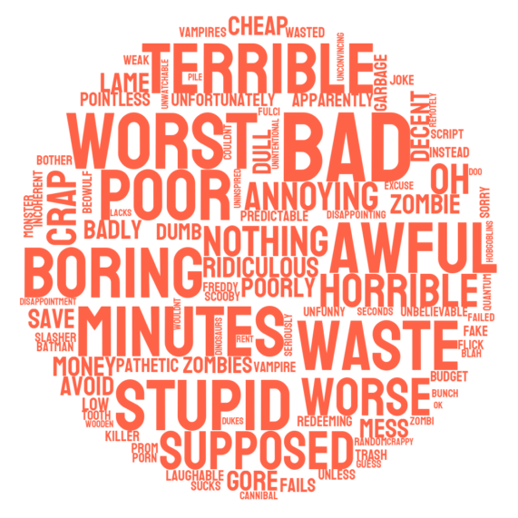
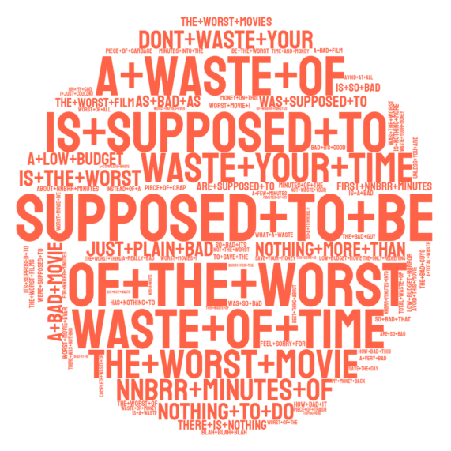

.. _wordcloud:

***********
Word Clouds
***********

*(Work in progress)*
~~~~~~~~~~~~~~~~~~~~

In this notebook, we will see how we can use the
`PySS3 <https://github.com/sergioburdisso/pyss3>`__ Python package to
generate word cloud using the values learned by the model using the
`clf.save_wordcloud() <https://pyss3.readthedocs.io/en/latest/api/index.html#pyss3.SS3.save_wordcloud>`__
function.

Let us begin! First, we need to import the modules we will be using:

.. code:: python

    %matplotlib inline
    
    from pyss3 import SS3
    from pyss3.util import Dataset

Then, before moving any further, we will unzip the training data. Since
it is located in `the same
directory <https://github.com/sergioburdisso/pyss3/tree/master/examples>`__
as this notebook file
(`wordcloud.ipynb <https://github.com/sergioburdisso/pyss3/blob/master/examples/wordcloud.ipynb>`__),
we could simply use the following command-line command:

.. code:: shell

    !unzip -u datasets/movie_review.zip -d datasets/

.. parsed-literal::

    Archive:  datasets/movie_review.zip

Let's create a new instance of the SS3 classifier. We're going to use
the same dataset that is used in the `Sentiment Analysis on Movie
Reviews <https://pyss3.readthedocs.io/en/latest/tutorials/movie-review-notebook.html#movie-reviews-notebook>`__
tutorial. This dataset was created collecting IMDB reviews tagged either
with *“pos”* or *“neg”*, indicating a positive or a negative review,
respectively.

.. code:: python

    # [create a new instance of the SS3 classifier]
    # Just ignore those hyperparameter values (s=.44, l=.48, p=.5)
    # they were obtained from the tutorial (after performing hyperparameter optimization)
    # We could've been used just the default values simply with
    # clf = SS3()
    # but classification results would have been suboptimal (not optimized)
    clf = SS3(s=.44, l=.48, p=.5)
    
    # Let's load the training set
    x_train, y_train = Dataset.load_from_files("datasets/movie_review/train")
    
    # Let the training begin...
    clf.train(x_train, y_train, n_grams=3)

.. parsed-literal::

    [2/2] Loading 'pos' documents: 100%|██████████| 5000/5000 [00:34<00:00, 145.45it/s] 
    Training on 'pos': 100%|██████████| 2/2 [00:16<00:00,  8.47s/it]

Let's create the default word cloud for the positive class:

.. code:: python

    clf.save_wordcloud("pos", plot=True)

Now the default cloud for the negative class, we will use a different
color. The complete list of HTML color names is available
`here <https://www.w3schools.com/colors/colors_names.asp>`__), however,
here we will be using "tomato" for the negative class:

.. code:: python

    clf.save_wordcloud("neg", color="tomato", plot=True)

Now well create a word cloud showing the learned word bigrams for the
positive class:

.. code:: python

    clf.save_wordcloud("pos", n_grams=2, plot=True)

.. image::../_static/wordcloud11_0.png

what about 3-grams?

.. code:: python

    clf.save_wordcloud("pos", n_grams=3, plot=True)

And 3-grams for the negative class?

.. code:: python

    clf.save_wordcloud("neg", n_grams=3, color="tomato", plot=True)

Only the top-5 positive 3-grams?

.. code:: python

    clf.save_wordcloud("pos", top_n=5, n_grams=3, plot=True)

All these word clouds have been saved to this in the current working
directory. Names have been created automatically based on the given
argument values.

.. code:: shell

    !ls

.. parsed-literal::

    custom_preprocessing.ipynb  wordcloud.ipynb
    datasets		    wordcloud_top100_neg.png
    extract_insight.ipynb	    wordcloud_top100_neg(trigrams).png
    imgs			    wordcloud_top100_pos(bigrams).png
    movie_genres.ipynb	    wordcloud_top100_pos.png
    movie_review.ipynb	    wordcloud_top100_pos(trigrams).png
    pyss3			    wordcloud_top10_neg(trigrams).png
    README.md		    wordcloud_top5_neg(trigrams).png
    ss3_models		    wordcloud_top5_pos(trigrams).png
    topic_categorization.ipynb

However, if you want to save the image with a custom name using a custom
path, you can use the ``path`` argument, as follows:

.. code:: python

    clf.save_wordcloud("pos", path="./my_beautiful_cloud.jpg")
