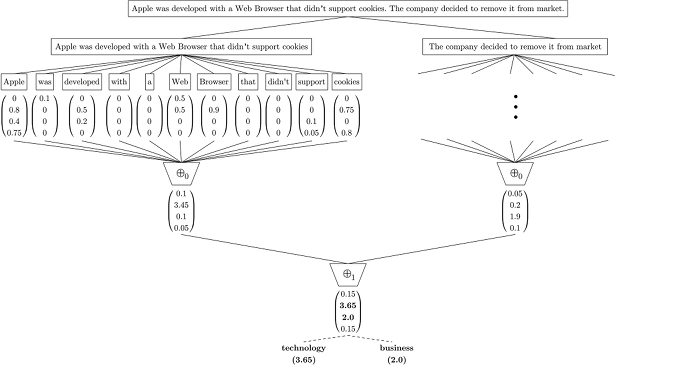

.. _ss3-classifier:

****************************
The SS3 Classification Model
****************************

The SS3 text classifier is a novel supervised machine learning model for text classification which has the **ability to naturally explain its rationale**. It was originally introduced in Section 3 of the paper `"A text classification framework for simple and effective early depression detection over social media streams" <https://dx.doi.org/10.1016/j.eswa.2019.05.023>`__ (preprint available `here <https://arxiv.org/abs/1905.08772>`__). Given its white-box nature, it allows researchers and practitioners to deploy explainable, and therefore more reliable, models for text classification (which could be especially useful for those working with classification problems by which people's lives could be somehow affected).

.. note::
    PySS3 also incorporates different variations of the original model, such as the one introduced in `"t-SS3: a text classifier with dynamic n-grams for early risk detection over text streams" <https://doi.org/10.1016/j.patrec.2020.07.001>`__ (preprint available `here <https://arxiv.org/abs/1911.06147>`__) which allows SS3 to recognize important variable-length word n-grams "on the fly".

.. _ss3-introduction:

Introduction
============

As it is described in more detail in original paper, SS3 first builds a dictionary of words for each category during the training phase, in which the frequency of each word is stored.
Then, using these word frequencies, and during the classification stage, it calculates a value for each word using a function :math:`gv(w,c)` to value words in relation to each category (:math:`gv` stands for "global value" of a word). :math:`gv` takes a word :math:`w` and a category :math:`c` and outputs a number in the interval [0,1] representing the degree of confidence with which :math:`w` is believed to **exclusively** belong to :math:`c`. For instance, suppose the categories are :math:`travel, technology, business`, and :math:`food`. After training, SS3 would learn to value words like "apple" and "the" as follows:

.. math::
    gv(apple, travel) = 0;\ \ \ &gv(the, travel) = 0;\\
    gv(apple, technology) = 0.8;\ \ \ &gv(the, technology) = 0;\\
    gv(apple, business) = 0.4;\ \ \ &gv(the, business) = 0;\\
    gv(apple, food) = 0.75;\ \ \ & gv(the, food) = 0;

Additionally, :math:`\overrightarrow{gv}` is the vectorial version of :math:`gv`. :math:`\overrightarrow{gv}` is only applied to a word and it outputs a vector in which each component is the word's :math:`gv` for each category. For instance, following the above example, we have:

.. math::
    \overrightarrow{gv}(apple) &= (0, 0.8, 0.4, 0.75)\\
    \overrightarrow{gv}(the) &= (0, 0, 0, 0)

These vectors are called **confidence vectors** (:math:`cv`). Thus, in this example :math:`(0, 0.8, 0.4, 0.75)` is the *confidence vector* of the word "apple", in which the first position corresponds to "travel", the second to "technology", and so on.

Classification
==============

As it is illustrated in the Figure below, the classification algorithm can be thought of as a 2-phase process.
In the first phase, the input is split into multiple blocks (e.g. paragraphs), then each block is in turn repeatedly divided into smaller units (e.g. sentences, words). Thus, the previously "flat" document is transformed into a hierarchy of blocks.
In the second phase, the :math:`\overrightarrow{gv}` function is applied to each word to obtain the "level-0" **confidence vectors**, which then are reduced to "level-1" **confidence vectors** by means of a level-0 **summary operator**, :math:`\oplus_0`.
This reduction process is recursively propagated up to higher-level blocks, using higher-level **summary operators**, :math:`\oplus_j`, until a single **confidence vector**, :math:`\overrightarrow{d}`, is generated for the whole input.
Finally, the actual classification is performed based on the values of this single **confidence vector**, :math:`\overrightarrow{d}`, using some policy ---for example, selecting the category with the highest *confidence value*.

.. note::
    By default, PySS3's **summary operators** are vector additions. However, in case you want to define your own custom summary operators, the ``SS3`` class exposes them using the following methods: `SS3.summary_op_ngrams <../api/index.html#pyss3.SS3.summary_op_ngrams>`__ (:math:`\oplus_0`), `SS3.summary_op_sentences <../api/index.html#pyss3.SS3.summary_op_sentences>`__ (:math:`\oplus_1`), and `SS3.summary_op_paragraphs <../api/index.html#pyss3.SS3.summary_op_paragraphs>`__ (:math:`\oplus_2`).

    **Figure:** Classification process for an example document.
    In the first stage, this document is split into two sentences (for instance, by using the dot as a delimiter) and then each sentence is also split into single words.
    In the second stage,  :math:`gv` is computed for every word to generate the first set of *confidence vectors*.
    Then all of these word vectors are reduced by a :math:`\oplus_0` operator to sentence vectors, :math:`(0.1, 3.45, 0.1, 0.05)` and :math:`(0.05, 0.2, 1.9, 0.1)` for the first and second sentence respectively.
    After that, these two sentence vectors are also reduced by another operator (:math:`\oplus_1`, which in this case is the addition operator) to a single *confidence vector* for the entire document, :math:`(0.15, 3.65, 2.0, 0.15)`.
    Finally, a policy is applied to this vector to make the classification ---which in this example was to select **technology**, the category with the highest value, and also **business** because its value is "close enough" to technology's

Note that using the *confidence vectors* in this hierarchy of blocks, it is quite straightforward for SS3 to visually justify the classification if different blocks of the input are colored in relation to their values.

.. note::  This characteristic is exploited by the PySS3's :ref:`live-test` tool to create the interactive visualizations. This tool can be used to monitor and analyze what the model is actually learning. You can check out the online live test demos available `here <http://tworld.io/ss3>`__ (both were created following the :ref:`tutorials <tutorials>`).

Additionally, the classification is also incremental as long as the **summary operator** for the highest level block (:math:`\oplus_1`, for this example) can be computed incrementally ---which is the case for most common aggregation operations such as addition, multiplication, maximum, etc.
For instance, suppose that later on, a new sentence is appended to the example shown above.
Since :math:`\oplus_1` is the addition of all vectors, instead of processing the whole document again, we could update the already computed vector, :math:`(0.15, 3.65, 2.0, 0.15)`, by adding the new sentence **confidence vector** to it ---
Note that this incremental classification, in which only the new sentence needs to be processed, would produce exactly the same result as if the process were applied to the whole document again, each time.

.. _ss3-hyperparameter:

Hyperparameters
===============

As it was described in the previous section, the global value (:math:`gv`) of a word is used to create the first confidence vectors, upon which higher level confidence vectors are then created until a single confidence vector for the whole input is obtained. Therefore, the global value (gv) of a word is the basic building block for the entire classification process.

In simple terms, the calculation of the **global value** (:math:`gv`) of a word in a category is obtained by multiplying three values. Namely, its **local value**, its **significance** factor, and its **sanction** factor. Additionally, in practice, the calculation of each one of these three values is controlled by a special hyperparameter. In more detail, we have:

.. math::
    global\ value = local\ value\cdot significance\cdot sanction

where:

* The **local value** values the word based on its local frequency in the category.

    * The :math:`\sigma` **or "smoothness" hyperparameter** allows you to "smooth" the relationship between the raw frequency and the final value assigned to the word. For instance, :math:`\sigma=1` indicates the **local value** is calculated directly proportional to the raw frequency, whereas smaller :math:`\sigma` values decrease the influence of this frequency (i.e the gap between the most and less frequent words becomes smaller). Think of this hyperparameter as if it were a "frequency tuner" that you can use to remove the "overshadowing" effect that extremely frequent words (but not important such as "the", "on", "with", etc.) produce on less frequent but really useful words.

* The **significance** factor captures the global significance of the word by decreasing the **global value** in relation to its **local value** in the other categories.

    * The :math:`\lambda` **or "significance" hyperparameter** allows you to controls how far the **local value** in a category must deviate from the **local value** in the other categories for the word to be considered important to that category.

* The **sanction** factor decreases the **global value** in relation to the number of categories the word is significant to (given by the **significance** value). 

    * The :math:`\rho` **or "sanction" hyperparameter** allows you to control how sensitive/severe this sanction is.

The name "SS3" is based on these three hyperparameters: Sequential Smoothness-Significance-and-Sanction (SS3).

.. note::
    In PySS3, these hyperparameters are referenced using the "s", "l", and "p" letters for :math:`\sigma`, :math:`\lambda`, and :math:`\rho`, respectively. For instance, let's say we want to create a new SS3 model with :math:`\sigma=0.32`, :math:`\lambda=1.24`, and :math:`\rho=1.1`, then we can create a new ``SS3`` object as follows: 

    .. code:: python

        clf = SS3(s=0.32, l=1.24, p=1.1)

    Additionally, PySS3 provides a **"forth hyperparameter"**, called :math:`\alpha` (and referenced using the "a" letter), which allows you to set the minimum global value that a word must have in order not to be ignored. That is, only words with :math:`gv > \alpha` will be taken into account during classification. By default :math:`\alpha = 0`, so no word is ignored. However, let's say we want to create the same previous SS3 model but this time using :math:`\alpha = 0.1`, then we could use:

    .. code:: python

        clf = SS3(s=0.32, l=1.24, p=1.1, a=0.1)

    **Tip:** when working on early classification tasks, using :math:`\alpha` values greater than 0 can yield better classification results.

.. seealso:: If you want to know how exactly these values are calculated in practice, as well as the formal definition of the algorithms, read Section 3 of the `original paper <https://arxiv.org/abs/1905.08772>`__ that, along with the corresponding equations, presents the main ideas that lead to them.
