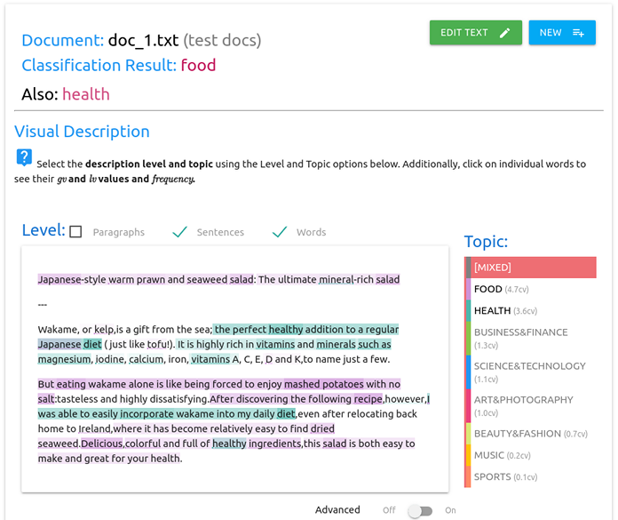
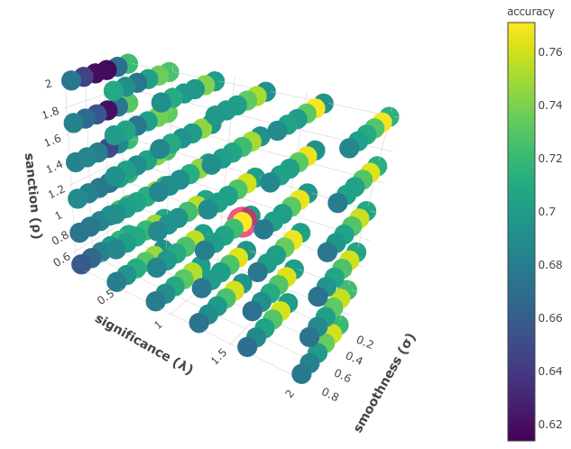
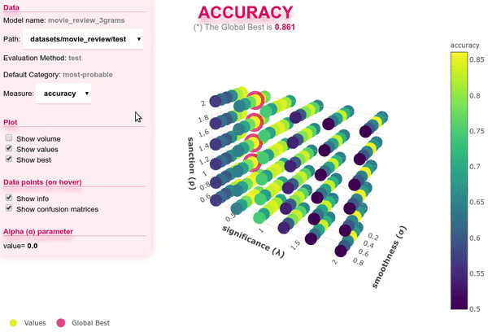
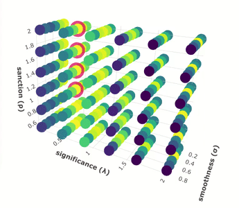
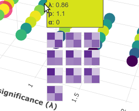
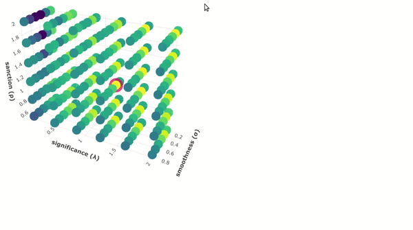
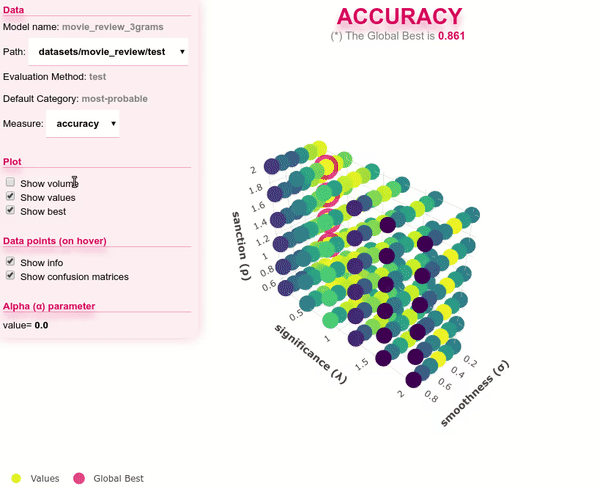

.. _visualizations:

*******************
Visualization Tools
*******************

PySS3 provides two main interactive visualization tools that users can use to analyze, monitor and understand what their models are learning and why they have done it.

.. _live-test:

Live Test
=========

The Live Test tool is an interactive visualization tool that allows you to actively test you models. This tool can be lunched with a single line of python code (or a single ``PySS3`` command), and it will provide a user interface (see :ref:`Figure 1 <live_test_screenshot>`) with which you can manually test the model using either a preloaded set of documents (for example, giving the ``x_test`` list or the path to a test set) or just letting you to type in your own documents. This tool will allow you to visually analyze and understand what your models are actually learning, at different levels (word n-grams, sentences, and paragraphs).

.. _live_test_screenshot:

    **Figure 1:** an screenshot of the Live Test user interface for an example document (taken from the :ref:`topic-categorization` tutorial)

.. seealso:: To learn how to lunch the Live Test visualization tool, using python or the ``PySS3 Command Line`` tool, we highly recommend doing both :ref:`tutorials`.

.. seealso:: You can try out the Live Test demos available online `here <http://tworld.io/ss3>`__ (both demos were created following the :ref:`tutorials <tutorials>`).

.. _evaluation-plot:

Interactive 3D Evaluation Plot
==============================

The evaluation plot can be automatically generated with the `Evaluation.plot() <../api/index.html#pyss3.util.Evaluation.plot>`__ function from the ``pyss3.util``'s ``Evaluation`` class, or with the ``PySS3 Command Line`` tool using any of the following commands:

* :code:`save evaluations` --- saves the interactive plot in a single and portable HTML file ("ss3_model_evaluation[*model_name*].html") in the current directory.

* :code:`plot evaluations` --- not only saves the plot but also opens it up in your web browser.

As shown in the figure below, in this plot, each data point represents an evaluation/experiment performed using a particular combinations of :ref:`hyperparameter <ss3-hyperparameter>` values (``s``, ``l`` and ``p``). These points are colored, using the viridis colormap, in relation to how good the performance was. The points with the global best performance are marked in pink.

.. note:: Two live examples of these evaluation plots are `"Movie Review (Sentiment Analysis)" <../_static/ss3_model_evaluation[movie_review_3grams].html>`__ and `"Topic Categorization" <../_static/ss3_model_evaluation[topic_categorization_3grams].html>`__, both were obtained following the :ref:`tutorials`.

The performance measure can be interactively changed using the options panel in the upper-left corner, as shown below.

When you move the cursor over a data point, information related to that evaluation is shown, including a "compact" version of the obtained confusion matrix.

And when k-fold cross-validation is used, it is shown the confusion matrix obtained in each fold. For example, the following image shows a data point for a 10-fold cross-validation evaluation:

Additionally, when you click a data point, it is shown a list of useful snippets to replicate the experiment, remove that evaluation point from cache, or to test that configuration using the Live Test tool.

Finally, using the options panel you can hide and show different parts of the plot. For instance, if you simply want to see the performance "pattern" in terms of the three hyperparameters, you can use "show volume" option as show below:  

This will allow you to better analyze the relationship between hyperparameters and performance.
